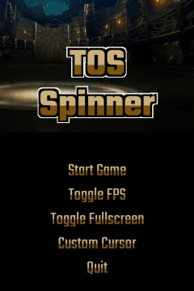

# TOS Spinner

Spinoff game of [Tower of Saviors](https://play.google.com/store/apps/details?id=com.madhead.tos.zh&hl=en&gl=US) made using pygame, by AdmiJW

---

 

## Usage 

Download the `dist.rar` from this repository. Run main.py. Takes a while to load but should execute normally after
some loading.

The rule is simple. Achieve the target score within 60 seconds timeframe in each level. Higher combos result in higher score gain.
Connecting 5 or more stones result in a powered runestone, which gives higher score.

---

 

## State Machine

To detect runestones to eliminate in weird shapes like 'L' or 'U' shape connected stones as a single group, I used
combination of linear scan and depth first search. The source code is in `src/States/Clearing.py`

---

 

## Notes

* Credits for art and sound assets goes to [MadHead](https://www.madhead.com/) for creating
this awesome game.
  
* Copyright of original music belongs to MadHead. Music inside this spinoff game recreated by me based on original music.
  
    Musics:
    * [Battle](https://www.youtube.com/watch?v=s_bRrbKfwxQ)
    * [Moonlight Theme](https://www.youtube.com/watch?v=N93gdhFEsBo)